# HelM

> 基于 **Tauri 2 + React 19 + Rust** 的现代 SSH / SFTP 桌面工作台

[](https://github.com/user/Helm/actions/workflows/release.yml)


---

## 目录

- [项目概览](#项目概览)
- [系统架构总览](#系统架构总览)
- [技术栈](#技术栈)
- [后端模块架构](#后端模块架构)
- [前端组件架构](#前端组件架构)
- [SSH 连接生命周期](#ssh-连接生命周期)
- [数据流：终端命令](#数据流终端命令)
- [数据流：文件传输](#数据流文件传输)
- [端口转发架构](#端口转发架构)
- [安全架构](#安全架构)
- [构建与发布流水线](#构建与发布流水线)
- [自动更新流程](#自动更新流程)
- [窗口与进程模型](#窗口与进程模型)
- [前端状态机](#前端状态机)
- [功能特性](#功能特性)
- [目录结构](#目录结构)
- [开发指南](#开发指南)

---

## 项目概览

HelM 是一款面向运维和开发人员的 **SSH / SFTP 桌面客户端**，集成终端、文件管理、端口转发、系统遥测、AI API 代理等功能于一体。单一可执行文件、原生窗口、零云端依赖，把多服务器运维所需的"终端 + 文件 + 转发 + 编辑 + 备份"收拢在一个加密工作区里。

---

## 系统架构总览

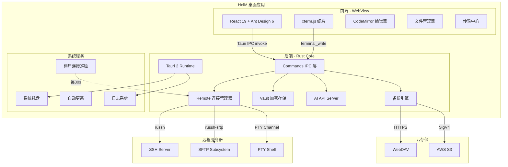

---

## 技术栈

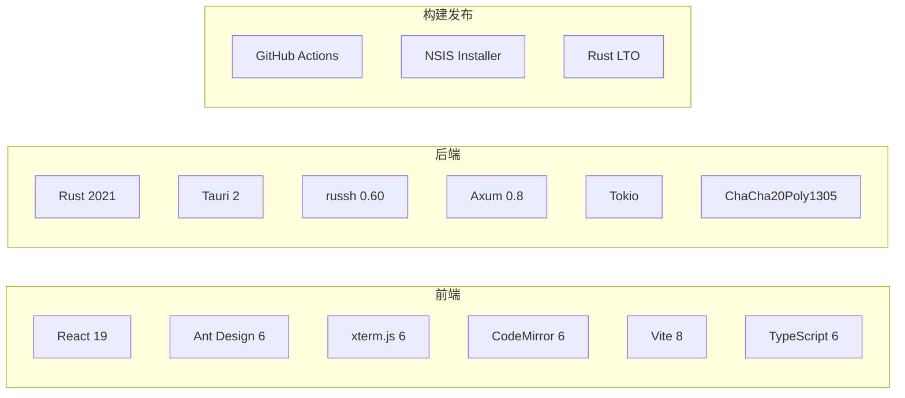

| 层级 | 技术 | 用途 |
|------|------|------|
| 框架 | Tauri 2 | 桌面应用壳、IPC、窗口管理、系统托盘 |
| 前端 | React 19 + TypeScript 6 | UI 组件与状态管理 |
| UI 库 | Ant Design 6 | 组件库 |
| 终端 | xterm.js 6 + WebGL Addon | 高性能终端渲染（失败自动回退） |
| 编辑器 | CodeMirror 6 | 远程文件编辑（JS/TS/Python/SQL/JSON/YAML/CSS/HTML） |
| 构建 | Vite 8 | 前端打包 |
| 后端 | Rust (Edition 2021) | 核心逻辑、异步 I/O |
| SSH | russh 0.60 | SSH2 协议实现 |
| SFTP | russh-sftp 2.1 | SFTP 子系统 |
| HTTP | Axum 0.8 + Tower-HTTP | AI API 代理服务器 |
| 加密 | ChaCha20-Poly1305 + Argon2 | Vault 数据加密 |
| 异步 | Tokio (fs/io-util/net/sync/time) | 异步运行时 |
| 网络 | reqwest (rustls) | HTTPS 请求（更新/备份） |
| 安装 | NSIS | Windows 安装包 |

---

## 后端模块架构

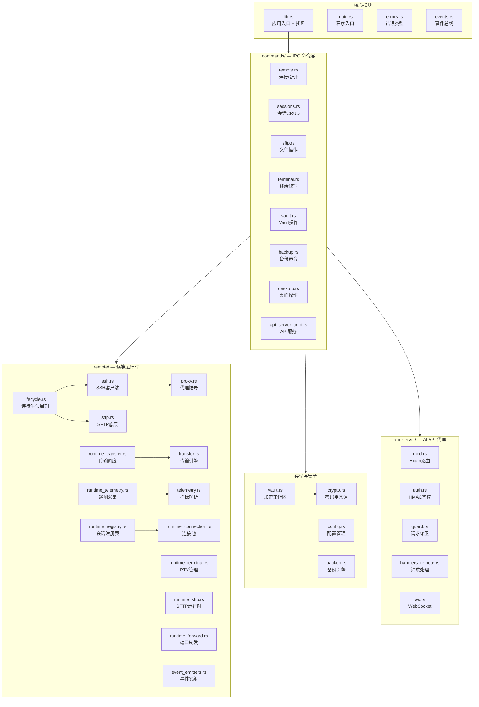

---

## 前端组件架构

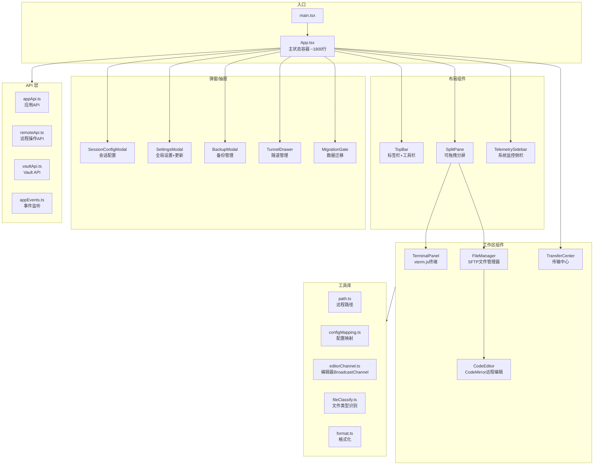

---

## SSH 连接生命周期

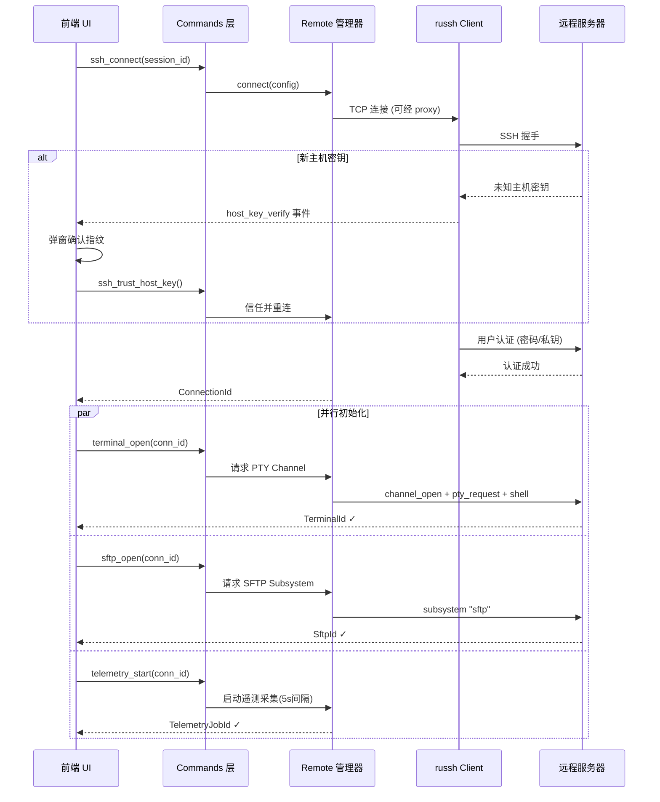

---

## 数据流：终端命令

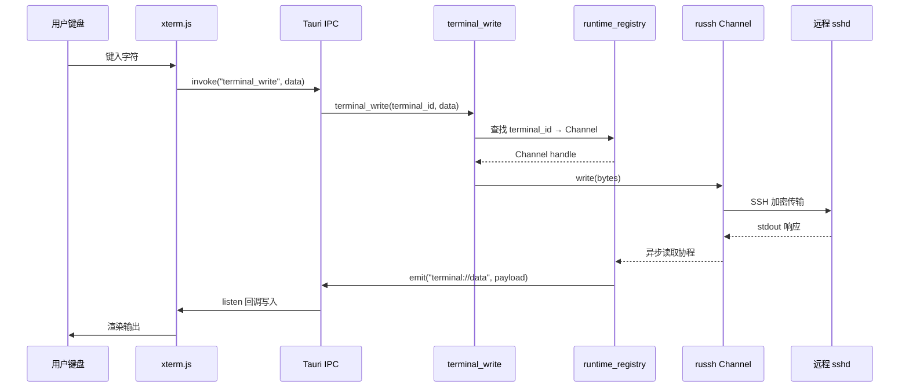

> 每会话一对独立的读写 Tokio 任务，跨会话不互相阻塞。前端通过 `requestAnimationFrame` 批量刷新终端输出，避免高频事件导致 UI 卡顿。

---

## 数据流：文件传输

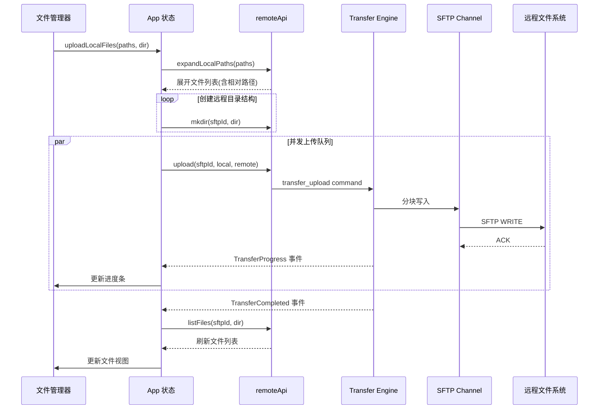

> 单文件上传走单连接 + 大缓冲（accelerated）；多文件走并发 + 普通缓冲，避免内存峰值。

---

## 端口转发架构

```mermaid
graph TD
    subgraph LocalForward["本地转发 (-L)"]
        LA[本地应用] -->|bind_host:bind_port| LH[HelM 监听]
        LH -->|SSH Channel| RS1[远程 target_host:target_port]
    end

    subgraph RemoteForward["远程转发 (-R)"]
        RA[远程应用] -->|bind_host:bind_port| RH[远程 sshd 监听]
        RH -->|SSH Channel| LS1[本地 target_host:target_port]
    end

    subgraph DynamicForward["动态转发 (-D)"]
        DA[本地应用] -->|SOCKS5| DH[HelM SOCKS 代理]
        DH -->|SSH Channel| ANY[远程任意目标]
    end
```

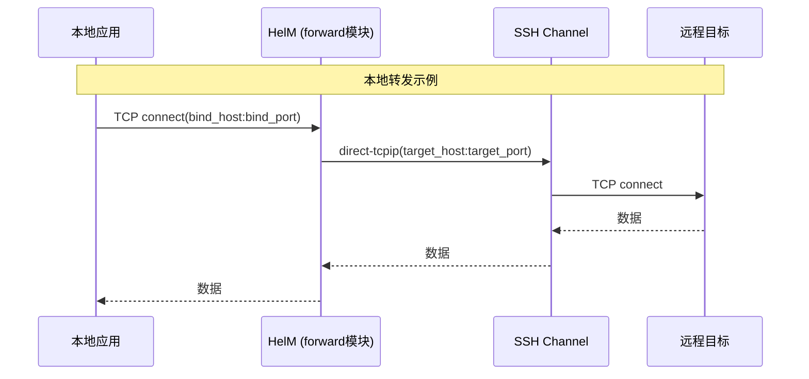

---

## 安全架构

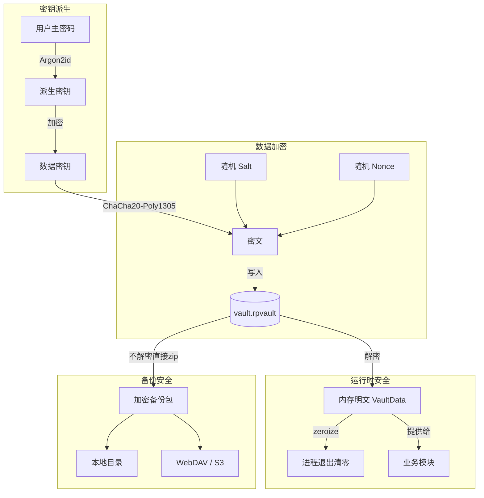

### 密钥与算法一览

| 组件 | 算法 | 用途 |
|------|------|------|
| Vault 主密钥 | Argon2id (内存硬度) | 从用户密码派生加密密钥 |
| 数据加密 | ChaCha20-Poly1305 (AEAD) | 加密会话配置、凭据、私钥 |
| API 鉴权 | HMAC-SHA256 | AI API Server 请求签名验证 |
| 更新签名 | RSA-PSS (SHA256, salt=32) | 验证安装包完整性 |
| 内存安全 | zeroize crate | 敏感数据使用后立即清零 |
| 传输安全 | SSH2 加密通道 | 所有远程通信端到端加密 |

### 安全关键性质

- 主密码**只在内存停留**，不持久化、不上送远端
- 派生密钥不离开 Rust 进程，前端只能拿到解密后的业务数据
- 备份包传上公共云盘**不暴露明文**——攻击者拿到也只是等长密文
- known-hosts 指纹纳入 vault，远端被 MITM 时本地立即觉察
- 前端表单禁用浏览器自动填充，凭据不留痕到 WebView 历史

---

## 构建与发布流水线

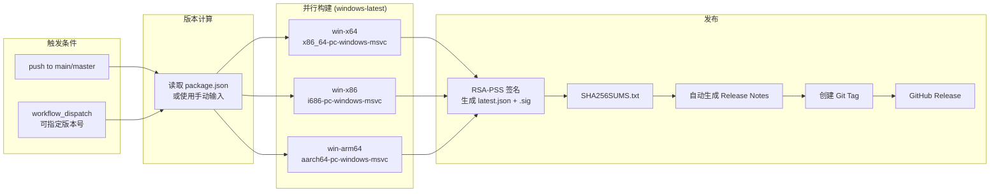

### 构建优化

- **Rust LTO** (thin) — 减小二进制体积
- **codegen-units = 1** — 最大化优化
- **strip = symbols** — 去除调试符号
- **Rust Cache** — Swatinem/rust-cache 加速 CI
- **npm cache** — Node 依赖缓存

---

## 自动更新流程

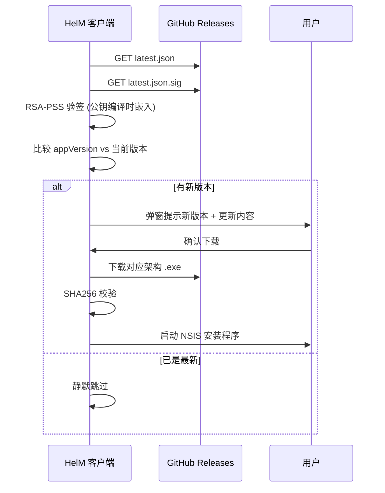

---

## 窗口与进程模型

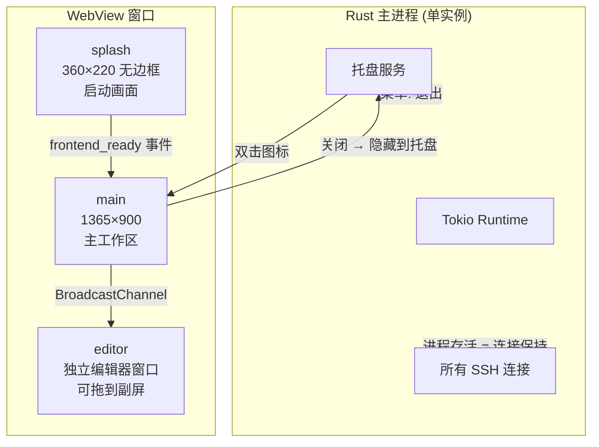

### 窗口行为

| 窗口 | 尺寸 | 特性 |
|------|------|------|
| splash | 360×220 | 无边框、居中、透明背景、启动后自动关闭 |
| main | 1365×900 | 可调大小、关闭=隐藏到托盘、标题栏自定义 |
| editor | 按需创建 | 独立窗口、BroadcastChannel 与主窗口通信 |

---

## 前端状态机

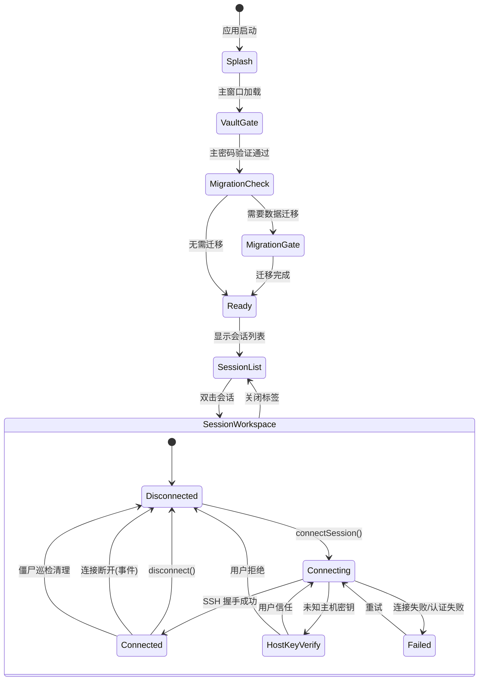

---

## 功能特性

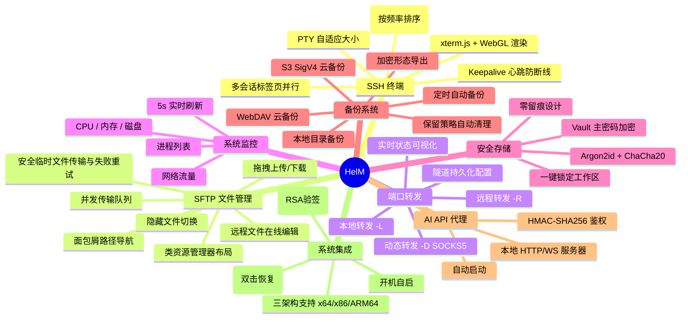

### 终端与会话

- **多会话并行** — 同时运行任意数量 SSH 会话，互不阻塞；会话级独立 Tokio 任务
- **会话分组** — 按生产/测试/客户等维度归类，分组保存于加密工作区
- **真终端体验** — xterm.js + addon-fit 自适应；支持 Ctrl+C / vim / top 等交互式程序
- **常用命令面板** — `quick_commands` 集中管理、搜索并一键发送到当前终端
- **断线重连与心跳** — keepalive 配合指数退避自动重连，支持手动断开后禁止自动重连
- **僵尸连接巡检** — 每 30s 检测并清理已断开的连接

### 文件管理（SFTP）

- **远程文件浏览器** — 类资源管理器布局，双击进入、面包屑路径、隐藏文件切换
- **拖拽上传/下载** — 操作系统拖拽与右键菜单双通道
- **传输中心** — 多任务并发、单独取消、失败重试，进度可视化
- **安全传输** — 先写临时文件，完成后校验并原子替换，失败不会破坏目标文件
- **低资源策略** — 非活动会话自动降低遥测频率，终端固定 5000 行回滚并支持 WebGL 回退
- **远程编辑** — 双击远端文件 → 独立 CodeMirror 子窗口 → 保存自动回写远端
- **文件搜索** — 远程目录内文件名搜索

### 端口转发与代理

- **三种转发模式** — 本地(-L) / 远程(-R) / 动态(-D, SOCKS) 一站式配置
- **转发可视化** — 隧道抽屉实时显示绑定端口、目标、状态；启停在 UI 内完成
- **出站代理** — 全局或会话级 SOCKS5 / HTTP CONNECT，便于跨内网访问

### 系统遥测

- **远端指标侧边栏** — CPU、内存、网络、磁盘实时折线图
- **无需额外 agent** — 后端通过 SSH exec 定时采样推送，无需在远端安装任何软件

### 安全与备份

- **主密码加密工作区** — 启动需输入主密码解锁；离开座位可一键锁定
- **零留痕** — 主密码不持久化、不上送远端；凭据仅以 ChaCha20-Poly1305 密文存于本地
- **三通道备份** — 本地目录 / WebDAV / S3 任选；可定时自动备份
- **保留策略** — 按"份数 + 天数"双维度自动清理旧备份
- **加密形态导出** — 导出的备份本身就是密文，传上云盘也无法离线破解

### 备份覆盖范围

| 类别 | 内容 |
|------|------|
| 会话 | 名称、分组、主机、端口、用户名、密码/私钥/passphrase |
| 终端 | 编码、主题、keepalive 间隔 |
| SFTP | 默认路径、是否显示隐藏文件 |
| 代理 | 单会话 SOCKS5 / HTTP CONNECT 配置 |
| 分组 | 自定义分组结构与排序 |
| 端口转发 | 全部已保存的本地/远程/动态隧道 |
| 全局代理 | AppSettings.proxy 出站代理 |
| 常用命令 | quick_commands 命令列表 |
| 已信任主机 | known-hosts 指纹列表 |
| 备份配置 | 本地目录、WebDAV/S3 凭据、保留策略、自动备份频率 |
| 历史记录 | backup_records 备份日志 |

> **一句话：所有需要你重新配的东西，都在备份里。** 换机只需安装 + 输入主密码 + 恢复备份即可继续工作。

---

## 目录结构

```
Helm/
├── src/                            # React 前端源码
│   ├── api/                        # Tauri IPC 命令封装
│   │   ├── remoteApi.ts            # 远端会话/SFTP/转发/遥测
│   │   ├── vaultApi.ts             # 加密工作区操作
│   │   ├── appApi.ts               # 应用级操作(更新/备份/设置)
│   │   ├── appEvents.ts            # 事件订阅(终端数据/传输进度/遥测)
│   │   └── runtime.ts              # 运行时工具
│   ├── app/                        # 应用入口、主题、懒加载
│   ├── components/                 # UI 组件
│   │   ├── TopBar.tsx              # 标签栏 + 工具栏
│   │   ├── TerminalPanel.tsx       # xterm.js 终端面板
│   │   ├── FileManager.tsx         # SFTP 文件管理器
│   │   ├── TransferCenter.tsx      # 传输中心(上传/下载/续传)
│   │   ├── TunnelDrawer.tsx        # 端口转发抽屉
│   │   ├── TelemetrySidebar.tsx    # 系统监控侧边栏
│   │   ├── BackupModal.tsx         # 备份/恢复弹窗
│   │   ├── SettingsModal.tsx       # 全局设置 + 自动更新
│   │   ├── SessionConfigModal.tsx  # 会话配置弹窗
│   │   ├── CodeEditor.tsx          # CodeMirror 远程编辑器
│   │   ├── EditorWindowApp.tsx     # 编辑器子窗口入口
│   │   ├── VaultGate.tsx           # 主密码解锁门
│   │   ├── MigrationGate.tsx       # 数据迁移门
│   │   └── shared/                 # 共享子组件
│   ├── lib/                        # 工具函数
│   │   ├── path.ts                 # 远程路径处理
│   │   ├── configMapping.ts        # 配置映射
│   │   ├── editorChannel.ts        # 编辑器 BroadcastChannel
│   │   ├── fileClassify.ts         # 文件类型识别
│   │   ├── format.ts              # 格式化工具
│   │   └── clipboard.ts           # 剪贴板
│   ├── styles/                     # 模块化 CSS
│   │   ├── tokens.css             # 设计令牌
│   │   ├── layout.css             # 布局
│   │   └── modals.css             # 弹窗样式
│   └── types.ts                    # 共享 TypeScript 类型
├── src-tauri/                      # Rust 后端源码
│   ├── src/
│   │   ├── remote/                 # 远端运行时(按职能拆分)
│   │   │   ├── mod.rs              # 模块导出
│   │   │   ├── lifecycle.rs        # 连接生命周期管理
│   │   │   ├── runtime_registry.rs # 会话注册表
│   │   │   ├── runtime_connection.rs # 连接运行时
│   │   │   ├── runtime_terminal.rs # PTY 终端管理
│   │   │   ├── runtime_sftp.rs     # SFTP 运行时
│   │   │   ├── runtime_transfer.rs # 传输调度
│   │   │   ├── runtime_forward.rs  # 端口转发运行时
│   │   │   ├── runtime_telemetry.rs # 遥测采集
│   │   │   ├── ssh.rs             # SSH 客户端封装
│   │   │   ├── sftp.rs            # SFTP 底层操作
│   │   │   ├── transfer.rs        # 传输引擎(分块/续传)
│   │   │   ├── telemetry.rs       # 指标解析
│   │   │   ├── proxy.rs           # SOCKS5/HTTP CONNECT 代理
│   │   │   └── event_emitters.rs  # 事件发射器
│   │   ├── commands/               # Tauri IPC 命令(按领域拆分)
│   │   │   ├── mod.rs
│   │   │   ├── remote.rs          # 连接/断开
│   │   │   ├── sessions.rs        # 会话 CRUD
│   │   │   ├── sftp.rs            # 文件操作
│   │   │   ├── terminal.rs        # 终端读写
│   │   │   ├── vault.rs           # Vault 操作
│   │   │   ├── backup.rs          # 备份命令
│   │   │   ├── desktop.rs         # 桌面操作
│   │   │   └── api_server_cmd.rs  # API 服务命令
│   │   ├── api_server/             # AI API 代理服务器
│   │   │   ├── mod.rs             # Axum 路由
│   │   │   ├── auth.rs            # HMAC 鉴权
│   │   │   ├── guard.rs           # 请求守卫
│   │   │   ├── handlers_remote.rs # 请求处理
│   │   │   └── ws.rs             # WebSocket
│   │   ├── vault.rs               # 加密工作区(Argon2+ChaCha20)
│   │   ├── crypto.rs              # 密码学原语
│   │   ├── backup.rs              # 本地/WebDAV/S3 备份引擎
│   │   ├── config.rs              # 配置管理(serde + 向后兼容)
│   │   ├── events.rs              # 前后端事件总线
│   │   ├── errors.rs              # 错误类型定义
│   │   ├── lib.rs                 # 应用入口 + 托盘 + 插件注册
│   │   └── main.rs               # 程序入口
│   ├── capabilities/               # Tauri 权限清单
│   ├── icons/                      # 应用图标(多尺寸)
│   └── tauri.conf.json            # Tauri 配置
├── tools/free-port/                # 启动前清理 1420 端口的小工具
│   ├── src/main.rs
│   └── Cargo.toml
├── tests/                          # Playwright E2E 测试
├── .github/workflows/              # CI/CD 流水线
│   └── release.yml                # 三架构并行构建 + 发布
├── build.ps1                       # Windows 交互式编译脚本
├── playwright.config.ts            # E2E 测试配置
├── vite.config.ts                  # Vite 构建配置
├── tsconfig.json                   # TypeScript 配置
└── package.json                    # 前端依赖 + 脚本
```

---

## 开发指南

### 前置要求

- Node.js >= 18
- Rust stable (需 `cargo`)
- npm (或 pnpm / yarn)
- Windows: WebView2 Runtime (Win10+ 已内置)

### 启动开发服务器

```powershell
# 安装依赖
npm install

# 启动开发模式（Vite 热重载 + Rust 增量编译）
# 启动前自动调用 tools/free-port 释放 1420 端口
npm run tauri:dev
```

### 生产编译

```powershell
# 交互式脚本（推荐）— 可选 LTO/普通/清理
.\build.ps1

# 或直接调用
npm run tauri:build
```

### 端到端测试

```powershell
npm run test:e2e
```

### build.ps1 选项

| 选项 | 说明 |
|------|------|
| LTO 编译 | 体积更小，编译更慢 (thin LTO + codegen-units=1) |
| 普通编译 | 速度快，适合日常开发 |
| 清理缓存 | 清理 cargo target / free-port target / dist / .vite / test-results |

---

## License

MIT
